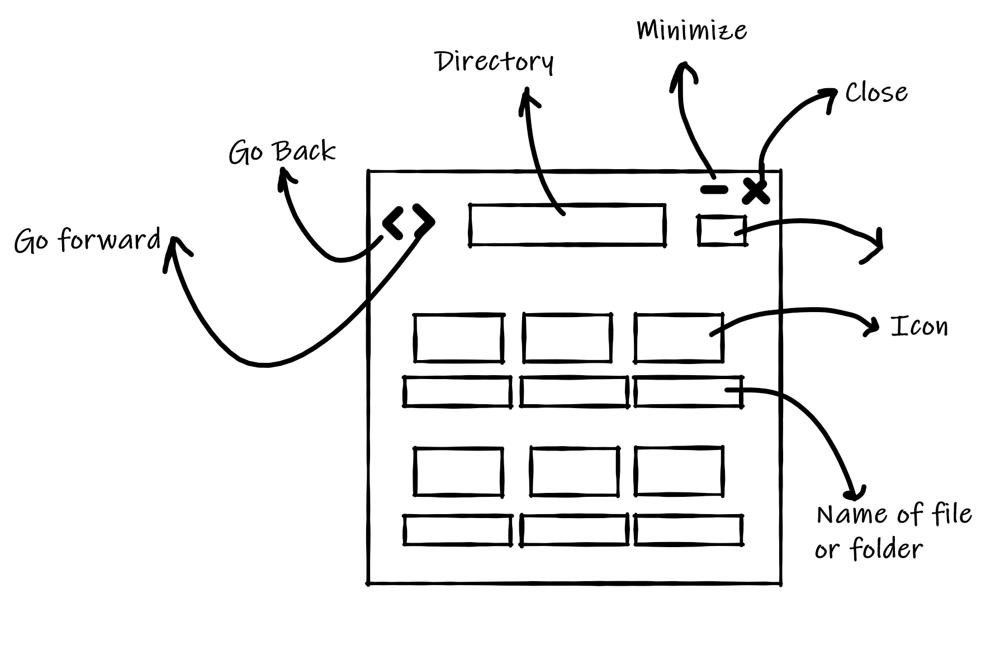

## file-explorer

A simple file-explorer using  [Electron](https://github.com/electron/electron)


Setting up the project:


Installing Node js:

[Download | Node.js](https://nodejs.org/en/download/)

[Installing Node.js via package manager | Node.js](https://nodejs.org/en/download/package-manager/)


Installing npm

https://www.npmjs.com/get-npm


Fork and clone the repository


Run:

```
npm install
```

```
npm start
```


> In case of any problems, kindly ask us the doubts in discord server in the corresponding channel


#### Resources to get started:

[Writing Your First Electron App | Electron](https://www.electronjs.org/docs/tutorial/first-app)

[Documentation | Electron](https://www.electronjs.org/docs)

[Documentation | Node.js](https://nodejs.org/en/docs/)


Sketch:


